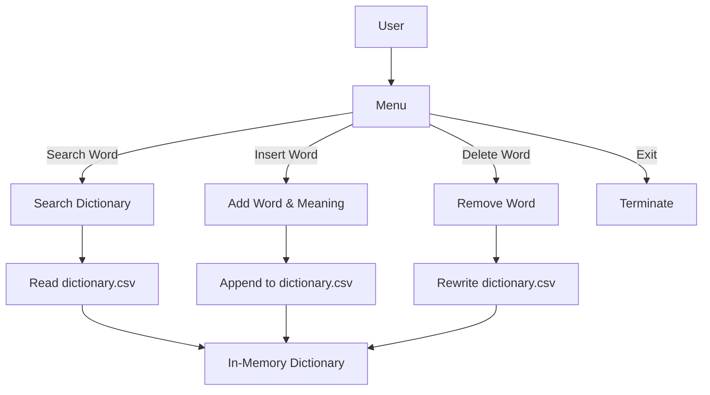
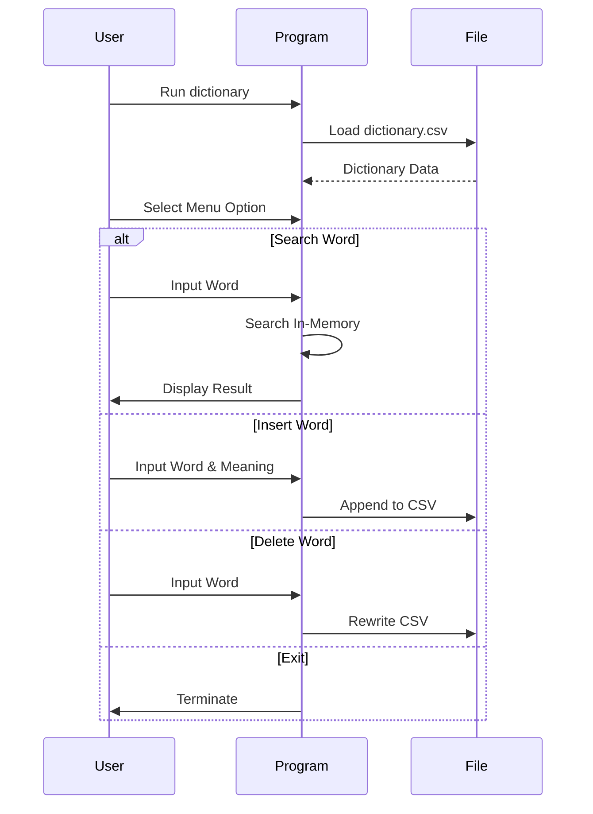

# Dictionary Management System

[](https://en.wikipedia.org/wiki/C_(programming_language))
[](https://github.com/Rakshak-D/dictionary/issues)
[](LICENSE)

A C-based Dictionary Management System for searching, inserting, and deleting words and their meanings, stored in a CSV file for persistent data management.


---

## ✨ Key Features

### 📖 Word Management
- Search for words with case-insensitive matching.
- Insert new words with their meanings, ensuring uniqueness.
- Delete existing words from the dictionary.

### 📄 Data Storage
- Stores dictionary entries in `dictionary.csv` (format: `word,meaning`).
- Supports up to 1000 entries with robust file I/O.
- Handles CSV parsing errors and malformed entries.

### 🔍 Input Validation
- Ensures words contain only alphabetic characters.
- Prevents duplicate words and validates input length.
- Sanitizes meanings to avoid CSV formatting issues.

### 🖥️ User Interface
- Interactive console menu with options: search, insert, delete, or exit.
- Clear prompts and error messages for user guidance.
- Formatted output for search results and operation status.

---

## 🚀 Quick Start

### Prerequisites
- C compiler (e.g., GCC)
- Standard C libraries (`stdio.h`, `stdlib.h`, `string.h`, `ctype.h`)
- Write permissions in the working directory

### Setup Instructions
```bash
# Clone repository
git clone https://github.com/Rakshak-D/dictionary.git
cd dictionary

# Compile the C program
gcc dictionary.c -o dictionary

# Run the program
./dictionary
```

**Input Requirements:**
- The program creates or uses `dictionary.csv` in the working directory.
- Example `dictionary.csv` format:
  ```
  apple,A fruit that grows on trees
  book,A collection of printed pages
  ```

**Example Run:**
```bash
Simple Dictionary

Menu:
1. Search Word
2. Insert Word
3. Delete Word
4. Exit
Enter your choice: 1
Enter the word to search: apple
Word found!
Word: apple
Meaning: A fruit that grows on trees
```

---

## 🌐 Project Overview

### System Diagram


### Execution Flow


---

## 🛠 Technology Stack

| Component       | Technologies                                |
|-----------------|--------------------------------------------|
| **Programming** | C (Standard Library)                       |
| **Data Storage**| CSV File (dictionary.csv)                  |
| **Functionality**| Dictionary Search, Insert, Delete          |
| **Dependencies**| stdio.h, stdlib.h, string.h, ctype.h       |

---

## 📂 Repository Structure

```
dictionary/
├── dictionary.c        # Main C program
├── dictionary.csv      # Dictionary data (created at runtime)
├── README.md           # Project documentation
├── LICENSE             # MIT License
└── .gitignore          # Git ignore file
```

---

## 📝 Core Dependencies

- Standard C libraries (included with any C compiler):
  - `stdio.h` (file I/O and console output)
  - `stdlib.h` (memory management)
  - `string.h` (string operations)
  - `ctype.h` (character handling)

No external libraries required.

---

## 🐛 Issue Reporting

[](https://github.com/Rakshak-D/dictionary/issues)

**Bug Report Template:**
```markdown
## Description
[Describe the issue clearly]

## Reproduction Steps
1. Run program...
2. Select option...
3. Observe...

**Expected Behavior**
[What should happen]

**Actual Behavior**
[What actually happens]

**Environment**
- OS: [e.g., Ubuntu 22.04]
- Compiler: [e.g., GCC 11.4]
- Input File: [e.g., dictionary.csv contents]

**Additional Context**
[Screenshots, error messages]
```

**Issue Labels**
- `bug` - Code or output errors
- `enhancement` - New feature requests
- `documentation` - README or comment improvements

---

## 📜 License

This project is licensed under the MIT License - see [LICENSE](LICENSE) for details.

---

## 📬 Contact & Support

**Project Maintainer**  
Rakshak D  
📧 rakshakmce@gmail.com  
🔗 [GitHub Profile](https://github.com/Rakshak-D)

---

## 👥 Contributors

- **Rakshak D**  
  🔗 [GitHub Profile](https://github.com/Rakshak-D)
- **Pranathi R**  
  🔗 [GitHub Profile](https://github.com/Pranathi38)

---

## 🛠️ Development Roadmap

### Next Milestones
- Add word editing functionality
- Support sorting words alphabetically
- Implement fuzzy search for similar words
- Add backup functionality for dictionary.csv

### Contribution Guide
1. Fork the repository.
2. Create a feature branch (`git checkout -b feature/new-functionality`).
3. Commit changes (`git commit -m 'Add new functionality'`).
4. Push to branch (`git push origin feature/new-functionality`).
5. Open a Pull Request.

**Code Standards**
- Follow ANSI C conventions.
- Include clear comments for functions and logic.
- Ensure portability across compilers.
- Test with sample `dictionary.csv` files.

---


